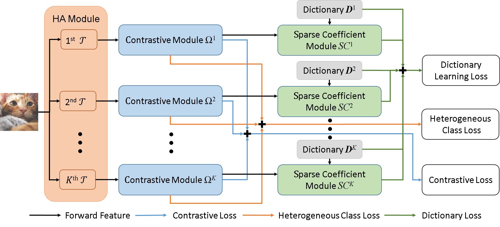

# ADMM-SRNet

## ADMM-SRNet: Alternating Direction Method of Multipliers based Sparse Representation Network for One-Class Classification

The paper is accepted by [IEEE Transactions on Image Processing, 2023.](https://ieeexplore.ieee.org/document/10124145)

## Usage
The code may contain some redundant parts and will be cleaned up soon.
Performance might vary a little due to randomness.

### Requirements
- python 3.6+
- torch 1.4+
- torchvision 0.5+
- CUDA 10.1+
- scikit-learn 0.22+
- tensorboard 2.0+
- [torchlars](https://github.com/kakaobrain/torchlars) == 0.1.2 
- [pytorch-gradual-warmup-lr](https://github.com/ildoonet/pytorch-gradual-warmup-lr) packages 
- [apex](https://github.com/NVIDIA/apex) == 0.1
- [diffdist](https://github.com/ag14774/diffdist) == 0.1 

### Datasets 
Please refer to [CSI (NeurIPS 2020)](https://github.com/alinlab/CSI)

### Training
The training is currently divided in to two stages.
The first stage learns the heterogeneous contrastive feature (HCF) network.
The second stage learns the sparse dictionary (SD) network

### Testing

### Visualizatoin

## Comparison with State-of-the-art Methods (%)

## Trained Models
[Google Drive](https://drive.google.com/drive/folders/1z0eTFlGp6aekYhOcN_oRZTtUD8wdjcmh?usp=sharing)

## Citation 
Please cite the following paper when you apply the code. 

[1] C.-Y. Chiou, K.-T. Lee, C.-R. Huang and P.-C. Chung, "ADMM-SRNet: Alternating Direction Method of Multipliers based Sparse Representation Network for One-Class Classification," IEEE Transactions on Image Processing, vol. 32, pp. 2843-2856, 2023, doi: 10.1109/TIP.2023.3274488.

[2] K.-T. Lee, C.-Y. Chiou and C.-R. Huang, "One-Class Novelty Detection via Sparse Representation with Contrastive Deep Features," in Proc. International Computer Symposium (ICS), 2020, pp. 61-66, doi: 10.1109/ICS51289.2020.00022.

## Acknowledgement
This work was supported in part by the National Science and Technology Council of Taiwan under Grant NSTC 111-2634-F-006-012, NSTC 111-2628-E-006-011-MY3, NSTC 112-2622-8-006-009-TE1, and MOST 111-2327-B-006-007.

We would like to thank the National Center for High-Performance Computing (NCHC) Taiwan for providing computational and storage resources.

Part of the code is modified from the official release of 
 "CSI: Novelty Detection via Contrastive Learning on Distributionally Shifted Instances" (NeurIPS 2020) by Jihoon Tack*, Sangwoo Mo*, Jongheon Jeong, and Jinwoo Shin.
https://github.com/alinlab/CSI
